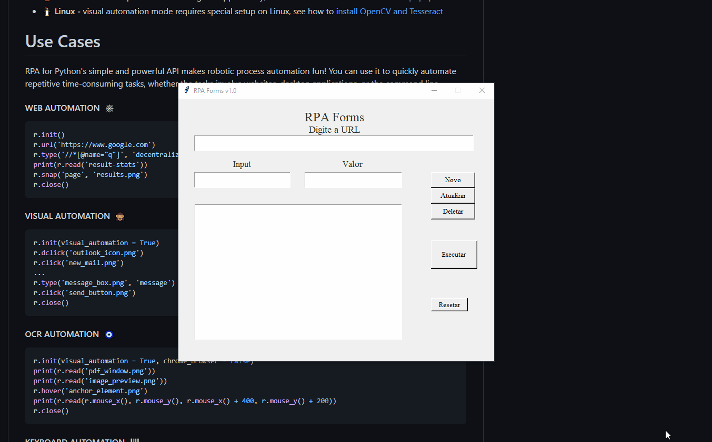
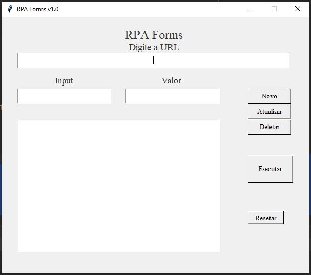

# RPA Forms v1.0

  
  

Projeto desktop cuja finalidade é automatizar inputs de formulários em processo de preenchimento automatico, para testes e finalizades diversas.

## Requisitos

* Python 3.7 >

## Iniciando

Passos para configurar o projeto com docker:

1. `cd` na pasta do projeto
2. `pip install -r requirements.txt`
3. `python main.py`

## Como usar

### 1- Você deve inserir a url do formulário 
### 2- Depois os respectivos valores do input (HTML) e valor a ser inserido 
### 3- Caso queria pressionar o enter apenas no value coloque = 'value[enter]' 
### 4- Clique em Novo que adicionará o registro
### 5- Clique em Executar para executar o Robô
